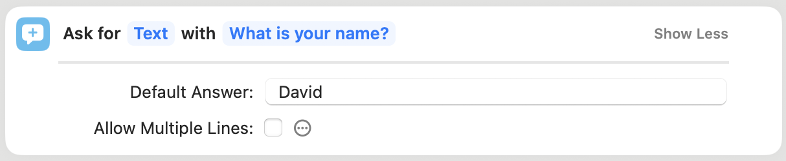

# WorkflowPy: Create iOS Shortcuts with Python code <!-- omit from toc -->

Write plain Python code, and compile it to an iOS Shortcut!

## Table of Contents <!-- omit from toc -->
- [Example](#example)
- [How it works](#how-it-works)
- [Supported Python code](#supported-python-code)
- [Magic functions](#magic-functions)
  - [`workflowpy.magic`](#workflowpymagic)
  - [`workflowpy.magic.types`](#workflowpymagictypes)
  - [`workflowpy.magic.custom`](#workflowpymagiccustom)
- [Type Confusion](#type-confusion)
- [Custom actions](#custom-actions)
  - [Format of a Shortcut](#format-of-a-shortcut)
  - [Find the source code of an action](#find-the-source-code-of-an-action)
  - [Find the parameters](#find-the-parameters)

## Example

Write some Python code, put it in a string, and compile it like so:

```python
from workflowpy.compiler import Compiler
from workflowpy.utils import sign_shortcut

code = """
from workflowpy.magic import *
thresholds = [90, 80, 60, 0]
names = ['wonderful', 'great', 'okay', 'terrible']
grade = int(input("Please enter your grade: "))
for i, threshold in enumerate(thresholds):
    if grade > threshold:
        print(f"You are doing {names[i]}!")
        break
"""

shortcut = Compiler().compile(code)
signed_shortcut = sign_shortcut(shortcut)

with open('How are my grades.shortcut', 'wb') as f:
    f.write(signed_shortcut)
```

Now, you can double click the `How are my grades.shortcut` file on your Mac, import it into the Shortcuts app, and run it!

## How it works

This project uses Python's `ast` module to convert your Python code into an Abstract Syntax Tree, which is then traversed to convert each line of code into one or more actions in Shortcuts. Because of this nature, not all Python commands are implemented; I'm working on implementing all of them soon!

## Supported Python code

- `from ... import ...`
  - Only supported modules (see the end of [this file](./workflowpy/modules/__init__.py) for details)
- `name = value`
- `input(prompt)` (Ask for Input), `print(value, ...)` (Show Result), `exit(code)` (Stop This Shortcut, `code` unused)
- `int(value)` (Number), `str(value)` (Text)
- `for name in range(val[, val])`
  - Only one or two parameters supported
- `for index, value in enumerate(iterable)`
  - Only unpacking is supported (i.e., two loop variables)
- `for name in list`, `for name in dict`
- `if x [OP] y ... elif ... else`
  - For a number `x`: `[OP]` in `==`, `!=`, `>`, `<`, `<=`, `>=`
  - For text `x`: `[OP]` in `==`, `!=`
  - For dictionary `y`: `[OP]` in `in`
- `break`, `pass`
- `str`, `int`, `float`, `list`, `dict` constants
- F-strings
- `list` and `dict` subscript access (read-only)
- `+`, `-`, `*`, `/` for numbers
- `-number`
  - **IMPORTANT**: Make sure you use a type annotation or conversion (see below) for this!
- Special constructions:
  - `int(input(prompt))`: an Ask for Input action with integer number type
  - `float(input(prompt))`: an Ask for Input action with number type

More coming soon!

## Magic functions

This library provides some "magic functions" that aren't really defined, but you can use them in your code to be compiled. You must import them from `workflowpy.magic` (or a submodule) to use them. Their type definitions are provided in the corresponding `.pyi` files, so your editor recognizes these functions. The magic functions provided include:

### `workflowpy.magic`

- `shortcut_input()`: This returns the "Shortcut Input" variable, which you can use in subsequent actions. It is returned as an Any type; you might want to cast the value (see "Type Confusion" below).
- `fetch(url, *, method, headers, data, json)`: This sends an HTTP request.
  - The `method` field, if provided, must be a literal string containing an uppercased HTTP method (one of `{'GET', 'POST', 'PUT', 'PATCH', 'DELETE'}`).
  - The `headers` field, if provided, must be a dict literal, but it may contain any expressions normally compilable.
  - The `data` and `json` fields are mutually exclusive, and they set the body of the request (for non-GET requests only). The difference is that if `json` is used, an additional action is added that converts the given input to JSON.

### `workflowpy.magic.types`

This module contains some content types that correspond to those defined in the Shortcuts app (e.g. `text`, `number`, `dictionary`, etc.). These can be used as type annotations, or in places where a content type is expected (like in `workflowpy.magic.custom.action` below).

### `workflowpy.magic.custom`

This module contains helper functions for you to use custom actions on the fly. The functions defined are:

- `action(id[, params[, output]])`: This function inserts a custom action at the current location in the generated Shortcut.
  - The `id` argument is the identifier of the action you want to insert. See the [custom actions](#custom-actions) section below for tips on obtaining the ID and parameters for the action you want to use.
  - The `params` argument is a literal dict of the parameters to pass to this action. The keys must be literal strings (no f-strings allowed); the values can be one of the following:
    - A literal (`True`, `123.45`, `"hello"`, etc.)
    - An f-string (this will get compiled into a token string; see [custom actions](#custom-actions) for what that means)
    - `attachment(variable)` (this will get compiled into a token attachment; see [custom actions](#custom-actions) for what that means)
    - An array of these allowed types
    - A dictionary, whose keys are literal strings and values are of these allowed types
- `attachment(variable)`: Helper for `action()`. Creates a token attachment.

## Type Confusion

Sometimes, the compiler will get confused as to what type a variable is. One common case is when getting a value from a dictionary. This is undesirable because Shortcuts treats things of different types differently; for example, an `if x == y` statement for numbers is different than for text.

To solve this issue, there are two ways:

1. Add an explicit conversion, such as `str(var)`. This will usually add an extra action (in this case, Text) to the shortcut, but it will ensure the value is now of the given type. The following conversions are supported: `int`, `str`, `float`.
2. If you're confident about the type a thing is, you can add a type annotation. This will coerce the type of the value in the generated Shortcut. The following annotations are supported: `int`, `float`, `str`, `bool`, `dict`, and `list[one_of_the_above]`. You can also use one of the types from the `workflowpy.magic.types` module ([see above](#workflowpymagictypes)) as type annotations. This might result in runtime errors if the value cannot be coerced.

## Custom actions

Sometimes, you want to extend the library's functionality for other actions. Perhaps you need to use some built-in action that not covered. Perhaps you want to support an external app (such as the Actions app). To do this, you must find the schema for the action; you need to know how to tell Shortcuts that "hey, run this action with these parameters, please." And to do that, you need some information.

### Format of a Shortcut

A Shortcut is, at its essence, a [property list](https://en.wikipedia.org/wiki/Property_list) (basically a JSON file stored in XML) that contains metadata about the Shortcut (its icon, execution settings such as Quick Action / Share Sheet, and input/output types), as well as a list of actions.

Each action is a dictionary that has the following form:

```xml
<dict>
  <key>WFWorkflowActionIdentifier</key>
  <string><!-- Action identifier --></string>
  <key>WFWorkflowActionParameters</key>
  <dict>
    <!-- Some parameters -->
  </dict>
</dict>
```

For example, here's what an "Ask for Input" action asking the user for their name, with the input box prefilled with "David" looks like:

```xml
<dict>
  <key>WFWorkflowActionIdentifier</key>
  <string>is.workflow.actions.ask</string>
  <key>WFWorkflowActionParameters</key>
  <dict>
    <key>UUID</key>
    <string>34F5F1FD-5542-452F-9073-7B711AF138FC</string>
    <key>WFAllowsMultilineText</key>
    <false/>
    <key>WFAskActionDefaultAnswer</key>
    <string>David</string>
    <key>WFAskActionPrompt</key>
    <string>What is your name?</string>
    <key>WFInputType</key>
    <string>Text</string>
  </dict>
</dict>
```

Here, the action identifier is `is.workflow.actions.ask`. It contains a bunch of parameters:

- `UUID`: This parameter is required for any action that has an output. It is used to later refer to the output variable. (That's how Apple's magic variables work!)
- `WFAllowsMultilineText`: This is a boolean that indicates if newlines are allowed in the input.
- `WFAskActionDefaultAnswer`: This is the default value.
- `WFAskActionPrompt`: This is the prompt.
- `WFInputType`: This is the input type.

If you look at this screenshot of the action:



You can see where each parameter is found (except for UUID). Hopefully this gives you an idea of what you need to do to support an additional action:

You need to 1) find the plist source of the action, 2) find the parameters it takes, 3) create a Python function that compiles the action from some Python source.

Let's go through it one by one.

### Find the source code of an action

There are many ways to do this. Personally, my favorite way is this:

1. Create an empty Shortcut.
2. Place the action you want to test in the Shortcut.
3. Fill out all the parameters.
   - If some parameters have a default value (like dropdowns), make sure you change that value. Otherwise, the key won't show up in the source.
4. Save it with some memorable name.
5. Install [this shortcut](https://www.icloud.com/shortcuts/91ff02ff3bf94ca9832a0140a858d563).
6. When prompted for the name of a shortcut, enter your memorable name.
7. Run the installed shortcut.

This will save your shortcut's plist file in your Downloads directory.

Now, open the plist file in any text editor, and look under the `WFWorkflowActions` key. There's your list of actions (which contain only one)!

### Find the parameters

If you filled out all the paramters, you should be able to see all of them under the `WFWorkflowActionParameters` key for the action.
